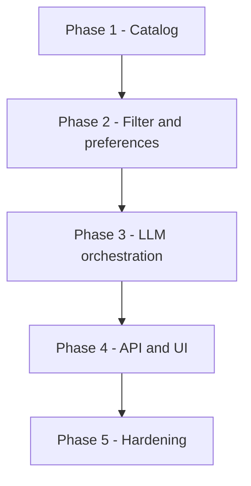

# Phase-Wise Architecture: AI-Powered Restaurant Recommendation System

This document is the canonical architecture for the Zomato-style recommendation service described in [problemStatment.md](./problemStatment.md). Each phase lists objectives, components, interfaces, data artifacts, and exit criteria. The plan is fixed at **five phases**.

---

## System context

**Purpose:** Combine a real restaurant dataset with user preferences and an LLM to produce ranked recommendations with natural-language explanations.

**High-level flow:**

1. **Offline or on-demand:** load and normalize restaurant records.
2. **Online:** accept preferences → filter catalog to a shortlist → prompt **Gemini** (Phase 3) → return structured UI payload.

**Non-goals** (unless you add them later): user accounts, live Zomato scraping, training custom embedding models.



---

## Phase 1 — Foundation, dataset contract, and catalog

### 1.1 Objectives

- Establish a single source of truth for restaurant data after Hugging Face ingest.
- Define a canonical schema so filtering, prompting, and UI do not depend on raw column names.
- Make ingestion repeatable (same command → same artifact).

### 1.2 Dataset source

**Primary:** [ManikaSaini/zomato-restaurant-recommendation](https://huggingface.co/datasets/ManikaSaini/zomato-restaurant-recommendation) via the `datasets` library or an export script.

### 1.3 Canonical schema (recommended fields)

Map Hugging Face columns to internal names (exact mapping depends on dataset columns; validate after first load):

| Internal field | Role |
|----------------|------|
| `id` | Stable string or hash (if missing, derive from name + location) |
| `name` | Restaurant name |
| `location` / `city` | For location filter (normalize: trim, title case, alias map e.g. Bengaluru → Bangalore if needed) |
| `cuisines` | List of strings or single pipe/comma-separated field parsed to list |
| `rating` | Float 0–5 (or dataset scale; document and normalize) |
| `cost_for_two` or `approx_cost` | Numeric or categorical; derive `budget_tier`: `low` \| `medium` \| `high` (or use numeric cost only per Phase 2 / improvements below) |
| `votes` / `review_count` | Optional; use for tie-breaking in shortlist |
| `address` or `locality` | Optional; richer prompts and UI |
| `raw_features` | Optional blob for “family-friendly” style hints if present in text columns |

### 1.4 Components

| Component | Responsibility |
|-----------|----------------|
| **Ingestion script** | Download/load split, select columns, rename to canonical schema |
| **Validators** | Row-level checks (rating range, required name/location), quarantine or drop bad rows with counts logged |
| **Transformers** | Parse cuisines, normalize city, compute `budget_tier` from rules (e.g. quantiles or fixed thresholds) |
| **Catalog store** | Versioned file: Parquet (preferred), SQLite, or JSON Lines for small prototypes |

Implementation lives under `restaurant_rec.phases.phase1` (`ingest`, `transform`, `validate`, `schema`) and `scripts/ingest_zomato.py`. Shared settings: `restaurant_rec.core.config`.

### 1.5 Artifacts and layout (suggested)

```text
data/
  raw/                    # optional: snapshot of downloaded slice
  processed/
    restaurants.parquet   # or restaurants.db
scripts/
  ingest_zomato.py        # or notebooks/01_ingest.ipynb for exploration-only phase
web/                      # static UI (index.html, static/*) served by Phase 4
src/restaurant_rec/
  core/                   # shared: AppConfig, load_config, repo_root
    config.py
  phases/
    phase1/               # catalog ingest + schema
    phase2/               # preferences, catalog load, deterministic filter
    phase3/               # Gemini client, prompts, parse/grounding, recommend()
    phase4/               # FastAPI app, HTTP schemas (backend); web UI planned
```

### 1.6 Configuration

Path to catalog file, encoding, and threshold constants (rating scale, budget cutoffs) in `config.yaml` or environment variables.

### 1.7 Exit criteria

- Documented schema with example row (JSON).
- One command reproduces `processed/restaurants.*` from Hugging Face.
- Documented row counts before/after cleaning and top reasons for drops.

---

## Phase 2 — Preference model and deterministic filtering

### 2.1 Objectives

- Convert user input into a typed preference object.
- Produce a bounded shortlist (e.g. 20–50 venues) that is small enough for one LLM call but diverse enough to rank.

### 2.2 Preference model (API / domain)

Structured input (align with problem statement):

| Field | Type | Notes |
|-------|------|--------|
| `location` | string | Required for first version; fuzzy match optional later |
| `budget` | enum *or* numeric | **Implemented improvement:** `budget_min_inr` & `budget_max_inr` — min and max approximate cost for two in INR; Phase 2 keeps rows with cost between boundaries. Gemini prompts (Phase 3) describe this range instead of low/medium/high tiers only. |
| `cuisine` | string or list | Match against cuisines (substring or token match) |
| `min_rating` | float | Hard filter: `rating >= min_rating` |
| `extras` | string (optional) | Free text: “family-friendly”, “quick service”; used in LLM prompt and optional keyword boost |

Optional extensions: dietary, neighborhood.

**Implemented improvement — locality vs city:** `GET /api/v1/localities` returns distinct catalog localities; the web UI `<select>` can use that endpoint. `GET /api/v1/locations` (distinct cities) remains for other clients. The recommend API still accepts JSON field `location` (matches catalog locality or city).

**Implemented improvement — shortlist cap:** `max_results_shortlist` removed from user input. `filter.max_shortlist_candidates` in `config.yaml` caps rows passed to the LLM (default 40).

### 2.3 Filtering pipeline (order matters)

1. **Location filter:** Exact or normalized match on city / location.
2. **Cuisine filter:** At least one cuisine matches user selection (case-insensitive).
3. **Rating filter:** `rating >= min_rating`; if too few results, optional relax step (document policy: e.g. lower min by 0.5 once).
4. **Budget filter:** Match `budget_tier` to user budget **or** apply numeric min/max `budget_min_inr` and `budget_max_inr` rules per configuration above.
5. **Ranking for shortlist:** Sort by rating desc, then votes desc; take top N (N capped by config, not user-editable).

### 2.4 Component boundaries

| Module (package path) | Responsibility |
|------------------------|----------------|
| `restaurant_rec.phases.phase2.preferences` | Pydantic validation, defaults (`UserPreferences`) |
| `restaurant_rec.phases.phase2.filter` | `filter_restaurants(catalog_df, prefs) -> FilterResult` |
| `restaurant_rec.phases.phase2.catalog_loader` | Load Parquet into a DataFrame at startup |

### 2.5 Edge cases

- **Zero matches:** Return empty shortlist with reason codes (`NO_LOCATION`, `NO_CUISINE`, etc.) for UI messaging.
- **Missing rating/cost:** Exclude from strict filters or treat as unknown with explicit rules in docs.

### 2.6 Exit criteria

- Unit tests for filter combinations and empty results.
- Shortlist size and latency predictable (log timing for 100k rows if applicable).

---

## Phase 3 — LLM integration: prompt contract and orchestration

Phase 3 uses **Google Gemini** (Gemini API / Google AI) as the LLM for ranking, explanations, and optional summaries. The API key is stored in a **`.env`** file at the project root (or the directory the app loads environment from) and must never be committed to version control (see §3.6).

### 3.1 Objectives

- Given preferences + shortlist JSON, produce ordered recommendations with per-item explanations and optional overall summary.
- Keep behavior testable (template version, structured output where possible).
- Call Gemini via the official **Google Gen AI SDK** for Python (`google-genai`) or equivalent HTTP client, using the API key loaded from `.env` into environment variables at runtime.

### 3.2 Inputs to the LLM

- **System message:** Role (expert recommender), constraints (only recommend from provided list; respect min rating and budget; if list empty, say so).
- **User message:** Serialized shortlist (compact JSON or markdown table) + preference summary + extras text.

### 3.3 Output contract

**Preferred:** JSON from the model (with schema validation and repair retry):

```json
{
  "summary": "string",
  "recommendations": [
    {
      "restaurant_id": "string",
      "rank": 1,
      "explanation": "string"
    }
  ]
}
```

**Fallback:** Parse markdown numbered list if JSON fails; log and degrade gracefully.

### 3.4 Prompt engineering checklist

- Include only restaurants from the shortlist (by id) to reduce hallucination.
- Ask for top K (e.g. 5) with one paragraph max per explanation.
- Instruct to cite concrete attributes (cuisine, rating, cost) from the data.

### 3.5 Orchestration service

| Step | Action |
|------|--------|
| 1 | Build shortlist (Phase 2) |
| 2 | If empty, return structured empty response (skip LLM or single small call explaining no matches) |
| 3 | Render prompt from template + data |
| 4 | Call Gemini API with timeout and max output tokens |
| 5 | Parse/validate response; on failure, retry once with “JSON only” reminder or fall back to heuristic order |

### 3.6 Configuration

- **API key (Gemini):** Store the Gemini API key in a **`.env`** file in the project root (or the directory the application loads environment variables from). Use `python-dotenv` or your framework’s equivalent so the key is exposed only as an environment variable at runtime. Add `.env` to `.gitignore` and commit only a **`.env.example`** (or README snippet) listing required variable names with empty or placeholder values—never real secrets.
- **Typical variable name:** `GOOGLE_API_KEY` (Google AI Studio / Gemini API; confirm against the client library you use—some setups use `GEMINI_API_KEY`).
- **Non-secret settings:** Gemini model id (e.g. `gemini-2.0-flash` or as documented), temperature (low for consistency), max output tokens, and display `top_k` can live in `config.yaml` or additional env vars as needed.

### 3.7 Exit criteria

- Golden-file or manual eval sheet for ~10 preference profiles.
- Documented latency and token usage for typical shortlist sizes.

---

## Phase 4 — Application layer: API and presentation

### 4.0 Implementation status

- **Backend (FastAPI):** implemented under `restaurant_rec.phases.phase4` — `POST /api/v1/recommend`, `GET /api/v1/localities`, `GET /api/v1/locations`, `GET /health`, CORS enabled. Automated tests cover validation (422), empty-filter responses (200), a mocked LLM path, and static UI routes (`tests/test_phase4_api.py`).
- **Frontend (Next.js App Router):** **implemented** — Full Next.js client built targeting Port `3000`. Matches the Zomato AI glassmorphic card design. The `next.config.mjs` proxies `/api` calls safely to FastAPI, negating CORS problems.

### 4.1 Objectives

- Expose a single recommendation endpoint (or CLI) that returns everything the UI needs.
- Render **Restaurant Name, Cuisine, Rating, Estimated Cost, AI explanation** per row (payload from Phase 3 merge; the `web/` UI displays it).

### 4.2 Backend API (recommended shape)

`POST /api/v1/recommend`

**Request body:** JSON matching Preferences (Phase 2).

**Response body:**

```json
{
  "summary": "string",
  "items": [
    {
      "id": "string",
      "name": "string",
      "cuisines": ["string"],
      "rating": 4.2,
      "estimated_cost": "medium",
      "cost_display": "₹800 for two",
      "explanation": "string",
      "rank": 1
    }
  ],
  "meta": {
    "shortlist_size": 35,
    "model": "string",
    "prompt_version": "v1"
  }
}
```

**Implementation note:** Merge LLM output with catalog rows by `restaurant_id` to fill cuisine, rating, and cost for display (do not trust the LLM for numeric facts).

**Backend (as implemented in codebase):** `restaurant_rec.phases.phase4.app` — FastAPI app with CORS enabled. Run from repo root after `pip install -e .`:

```bash
uvicorn restaurant_rec.phases.phase4.app:app --reload
```

**Additional routes:** `GET /api/v1/localities` (distinct `locality` values for datalist), `GET /api/v1/locations` (distinct `city`), `GET /health` (includes `catalog_rows`). **`GET /`** serves **`web/index.html`** when present; **`/static/*`** maps to **`web/static/`**.

- Open **`http://127.0.0.1:8000/`** for the web UI; interactive API: **`http://127.0.0.1:8000/docs`**.
- Loads `config.yaml` and `paths.processed_catalog` at startup; the Gemini API key from **`.env`** (e.g. `GOOGLE_API_KEY`) applies to `POST /api/v1/recommend` when not using tests/mocks.

For unit tests, use **`create_app(catalog_df=..., cfg=..., generate_fn=..., serve_web_ui=True|False)`** to inject a catalog, avoid calling Gemini, and optionally disable static mounting.

### 4.3 UI — basic web app (end-to-end)

**Status: implemented (basic).** Layout:

```text
web/
  index.html
  static/
    styles.css
    app.js
```

The page loads localities into a **datalist** (type-ahead), submits **location**, optional **cuisine**, **min_rating**, **budget_min_inr**, **budget_max_inr**, **extras**, then renders **summary**, **meta**, and **cards** (name, rating, cost, cuisines, explanation). Errors and empty results show inline messages.

| Option | Status / use when |
|--------|-------------------|
| Web app | **Implemented** — form + result cards + meta (`web/`) |
| Backend API | **Implemented** — JSON as in §4.2 |
| CLI | Optional; curl or `/docs` |
| Notebook | Teaching/demo only |

### 4.4 Cross-cutting concerns

- CORS if SPA on different origin.
- Rate limiting if exposed publicly.
- Input validation return 422 with field errors.

### 4.5 Exit criteria

- **Backend:** `POST /api/v1/recommend` returns structured summary, items, and meta; validation errors return 422; empty filter outcomes return 200 with empty items and a clear summary. *(Met for backend; covered by `tests/test_phase4_api.py`.)*
- **Browser / `web/`:** user opens `/`, submits preferences → sees summary and ranked cards (or empty-state message). *(Basic UI met; polish optional.)*
- Empty and error states: backend summaries + UI status line and empty-state copy.

---

## Phase 5 — Hardening, observability, and quality

### 5.1 Objectives

Improve reliability, debuggability, and iterative prompt/dataset updates without breaking clients.

### 5.2 Caching

- **Key:** hash of (preferences, shortlist content hash, `prompt_version`, model).
- TTL or LRU for repeated queries in demos.

### 5.3 Logging and metrics

- Structured logs: `shortlist_size`, `duration_filter_ms`, `duration_llm_ms`, outcome (success / empty / error).
- Avoid logging full prompts if they contain sensitive data; truncate or redact.

### 5.4 Testing strategy

| Layer | Tests |
|-------|--------|
| Filter | Unit tests, property tests optional |
| Prompt | Snapshot of rendered template with fixture data |
| API | Contract tests for `/recommend` |
| LLM | Marked optional integration tests with recorded responses |

### 5.5 Deployment (optional)

- Backend will be deployed in Streamlit.
- Frontend will be deployed in Vercel.
- Containerize app + mount `data/processed`.
- Secrets via env; no keys in repo.

### 5.6 Exit criteria

- Runbook: how to refresh data, bump prompt version, rotate API keys.
- Basic load/latency note for expected concurrency.

---

## Dependency graph between phases

```text
Phase 1 (Catalog)
    │
    ▼
Phase 2 (Filter + Preferences)
    │
    ▼
Phase 3 (LLM orchestration)
    │
    ▼
Phase 4 (API + UI)
    │
    ▼
Phase 5 (Hardening)
```

Phases 2–3 can be prototyped in a notebook before extraction into modules; Phase 4 should consume stable interfaces from 2 and 3.

---

## Technology stack (suggestion, not mandatory)

| Concern | Suggested default |
|---------|-------------------|
| Language | Python 3.11+ |
| Data | pandas or polars + Parquet |
| Validation | Pydantic v2 |
| API | FastAPI |
| LLM | **Gemini** (Google AI / Gemini API); API key in **`.env`** → env (e.g. `GOOGLE_API_KEY`) |
| UI | Simple static `web/` or React/Vite or Streamlit for speed |

Adjust to your course constraints; the phase boundaries stay the same.

---

## Traceability to problem statement

| Problem statement item | Phase |
|------------------------|--------|
| Load HF Zomato dataset, extract fields | 1 |
| User preferences (location, budget / `budget_min_inr` & `budget_max_inr`, cuisine, rating, extras) | 2, 4 |
| Filter + prepare data for LLM | 2, 3 |
| Prompt for reasoning and ranking | 3 |
| LLM rank + explanations + summary | 3 |
| Display name, cuisine, rating, cost, explanation | 4 |

---

## Document history

| Version | Notes |
|---------|--------|
| Current | Content aligned with [phase-wise-architecture.md](./phase-wise-architecture.md); **five phases** only (1–5). Phase 3 LLM: **Gemini**; API key via **`.env`**. |
